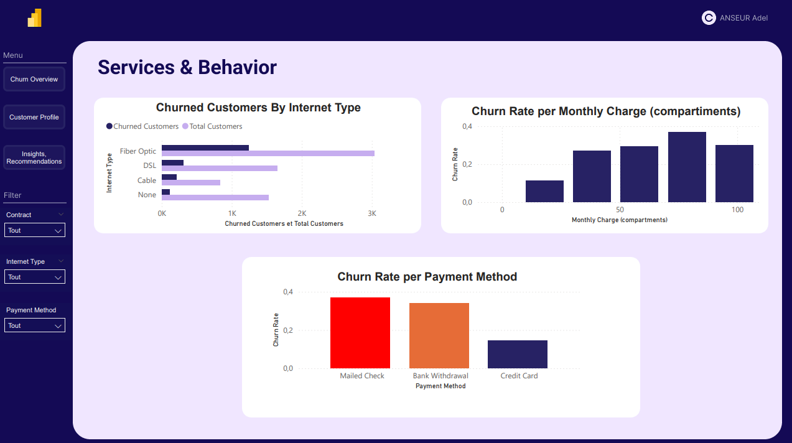
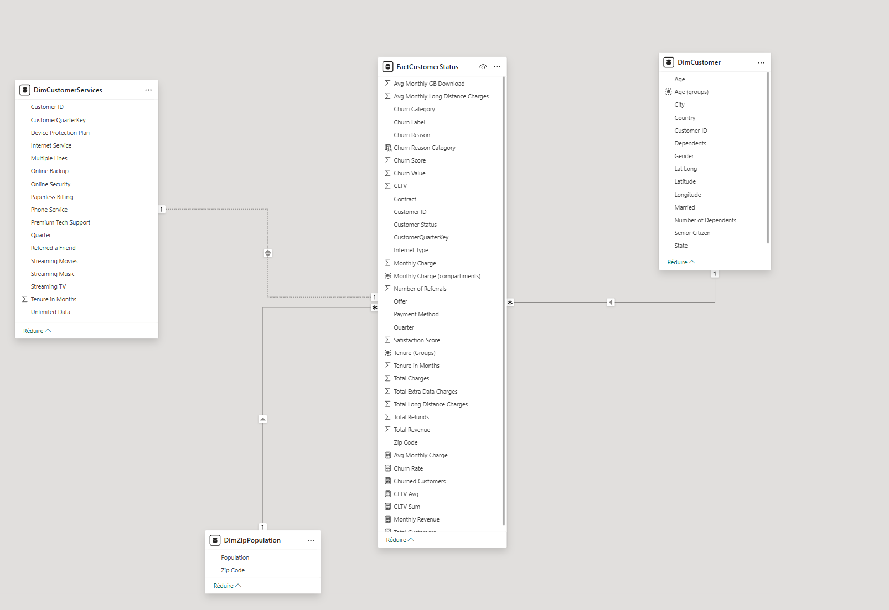

# PowerBi-Project Churn Analysis

<div align="center">
  
  
  <h3> Interactive Business Intelligence Dashboard for Churn Analytics </h3>
  
  
  
  
</div>


## Dashboard Preview

### Page 1 — Churn Overview


### Page 2 — Customer Profile


### Page 3 — Services & Behavior



---

# Project Overview 
## Objective : 

The goal of this project is to learn and apply data analysis using Power BI, one of the most widely used business intelligence tools in modern organizations. Power BI offers powerful capabilities for:

- Data cleaning and transformation

- Data modeling

- Interactive visualization

- Business-focused storytelling

Mastering Power BI is a strong asset for any data analyst, as it allows you to communicate complex insights in a clear, interactive, and professional way.
This project also serves as a demonstration of my analytical skills to recruiters, data professionals, and anyone interested in data-driven decision making.

## Data Source : 

The dataset used for this project is the IBM Telco Customer Churn Dataset, containing data for 7,043 fictional telecom customers in California (Q3).

The dataset includes:

- Customer demographics

- Geographical information

- Contract and service usage

- Billing and pricing metrics

- Churn labels and churn scores

- Satisfaction levels

- Customer Lifetime Value (CLTV)

I selected this dataset because customer churn is one of the most critical business problems in the telecom industry. This project simulates a real-world business scenario where a data analyst must understand customer behavior and propose actionable retention strategies.

Using a public dataset also ensures that no sensitive or proprietary company data is exposed.

## Technology : 

For this end-to-end project, I used:

- Power BI desktop → data understanding, cleaning, modeling, DAX measures, and dashboard design

- Power Query → data transformation

- Figma → creation of a clean, modern dashboard layout and UI components

- GitHub → version control and project documentation

## Business Impact : 

This project demonstrates the ability to:

- Reduce customer churn through data-driven insights

- Identify high-risk customer segments

- Highlight retention opportunities

- Translate analytics into business strategy

The final dashboard bridges technical analysis and business storytelling, which is essential for modern BI and analytics roles.

---

# Problem Statement

Telecom companies face a major challenge: customer churn. Acquiring new customers is significantly more expensive than retaining existing ones.
Understanding who churns, why they churn, and how to prevent it is essential for profitability.

This project answers the following key business questions:

1. What is the overall churn rate?

2. Which customer segments are most likely to churn?

3. How do services, contracts, charges, and satisfaction levels influence churn?

4. Which regions show higher churn risk?

5. What strategic actions can reduce churn and protect revenue?

The goal is to provide clear, actionable insights to guide retention strategy, customer experience improvements, and revenue protection.

# Data Modeling

To support efficient analysis, I designed a clean Star Schema with one Fact table and four Dimensional tables.

## Fact Table
FactCustomerStatus

Contains:

- Churn status and churn scores

- Satisfaction scores

- CLTV

- Billing and revenue metrics

- Service usage (merged from Services table)

## Dimension Tables
| Dimension Table |	Description	| Key |
| -------------------- | -------------------------------------------------- |----|
| DimCustomerDemographics |	Age, gender, dependents, senior status | CustomerID |
| DimLocation	| City, State, Zip Code, coordinates	| CustomerID |
| DimZipPopulation |	Population per ZIP Code	| ZipCode |

## Relationships

DimCustomerDemographics (1) → (*) FactCustomerStatus

DimLocation (1) → (*) FactCustomerStatus

DimZipPopulation (1) → (*) DimLocation

DimDate (1) → (*) FactCustomerStatus

This structure allow:

- ✅ fast filtering
- ✅ clean slicing by geography and demographics
- ✅ scalable DAX calculations



---

# Key DAX Measures

## Core Metrics

```DAX
Total Customers = COUNTROWS(FactCustomerStatus)

Churned Customers = CALCULATE(
    COUNTROWS(FactCustomerStatus),
    FactCustomerStatus[Churn Value] = 1
)

Churn Rate = DIVIDE([Churned Customers], [Total Customers])

Average Monthly Revenue = AVERAGE(FactCustomerStatus[Monthly Charge])

Total Revenue = SUM(FactCustomerStatus[Total Revenue])
```

## Customer Value & Risk

```DAX
Average CLTV = AVERAGE(FactCustomerStatus[CLTV])

High Risk Customers = CALCULATE(
    COUNTROWS(FactCustomerStatus),
    FactCustomerStatus[Churn Score] >= 60
)
```
---

# Dashboard Design & Storytelling

Designed using Power BI + Figma, the dashboard follows a story-driven approach with four pages.

## Page 1 — Executive Overview
Purpose:

Provide a high-level understanding of churn, revenue, and customer base health.

Visuals:

- KPI Cards

  - Churn Rate

  - Total Customers

  - Monthly Revenue

  - Avg CLTV

- Donut Charts / Bars

  - Churn by Contract Type

  - Churn by Internet Service

  - Churn by Tenure Group

- Slicer Panel

  - Gender

  - Contract

  - Internet Type

Goal:
Quickly identify the most problematic segments.

## Page 2 — Customer Profile

Purpose:

Understand who is churning and where churn is most concentrated.

Visuals:

- Bar Chart → Churn by Age Group

- Bar Chart → Churn by Gender

- Column Chart → Churn by Number of Dependents

- Bar Chart → Top 10 Cities with Highest Number of Churned Customers

Goal:
Identify the customer profiles and geographic hotspots most impacted by churn

## Page 3 — Services & Behavior

Purpose:

Understand how customer behavior, service type, and billing choices influence churn.

Visuals:

- Bar Chart → Churned Customers by Internet Type

- Column Chart → Churn Rate by Monthly Charge Bands

- Bar Chart → Churn Rate by Payment Method

Goal:
Reveal how service adoption and pricing structures affect customer retention and identify risky usage patterns.

## Page 4 — Strategic Insights & Recommendations

Purpose:

Translate analytics into business decisions.

Sections:

- Key Insights

- Strategic Recommendations

- Business Impact

This page focuses on executive-level takeaways instead of charts.

---

# How to Use This Project

You can explore:

- Dashboard screenshots in /assets/images/

- Exported PDF in /dashboard/exports/

- Power BI files locally (available upon request if size is large)

---

# Author

Anseur Adel
Data science student

